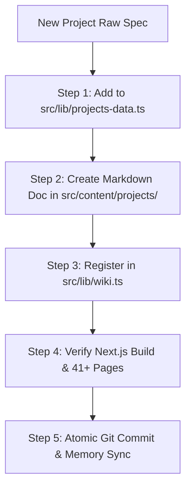

# Showcase Project Builder (Standardized Project & Skill Engineering Protocol)

The **Showcase Project Builder** protocol standardizes the creation, formatting, and multi-channel publication of flagship projects and autonomous agent skills across the personal website ecosystem (`https://alim.dest.page`).

---

## 🏛️ 1. The 8 Mandatory Pillars for Every Showcase Project

Every newly added project or skill **MUST** contain all 8 standardized pillars:

1. **🎨 High-Impact 16:9 YouTube-Style Thumbnail**:
   - High-contrast, click-worthy visual art generated via AI (`generate_image` tool with `AspectRatio: '16:9'`) or bespoke assets following the [YouTube Thumbnail Skill](https://github.com/charlie947/social-media-skills/blob/main/skills/youtube-thumbnail/SKILL.md) standards.
   - Saved to `public/thumbnails/<slug>.jpg` (e.g. `public/thumbnails/wiki.jpg`).
   - Container **MUST STRICTLY** use `aspect-video` (`aspect-[16/9]`) across all layouts (marquee and detail pages).
   - Smooth cinematic hover zoom (`group-hover:scale-105 transition-transform duration-700`).
   - Clean framing without redundant overlay badges obscuring headline artwork.

2. **⏱️ Initiation Date & Relative Elapsed Time ("как давно")**:
   - ISO Date: `initiationDate` (e.g. `2026-08-10`).
   - Month/Year Badge: `dateDisplay` (e.g. `Aug 2026`).
   - Relative Time Ago: `timeAgo` (e.g. `1 week ago`, `3 weeks ago`, `2 months ago`).

3. **🏷️ Title, Command Hook & TL;DR**:
   - Command identifier (e.g. `/wiki`, `/presentation`, `/skill-visualizer`, `/styleref`, `/design-md-generator`, `/end`).
   - Impactful Title and Plain-Language Subtitle.
   - **The Big Idea** (1–2 sentences explaining the core value and breakthrough).

4. **⚡ Live Interactive Demo / Runner**:
   - Working interactive demo runner, canvas playground, or modal tool directly accessible at `/projects/<slug>#demo` or embedded into the page.

5. **📐 16:9 Skill Visualizer Vector Architecture Map**:
   - Standalone SVG flowchart conforming to the `/skill-visualizer` standard (`viewBox="0 0 1600 900"`).
   - Dynamic Density Scaling (3 to 6 milestone nodes).
   - Large readable typography (Title: 24–28px bold, Body: 18–21px, single-line headers).
   - Zero void space (calibrated card heights).
   - Sharp geometric vector markers (`<path d="M 0 1.5 L 8 5 L 0 8.5 z" />`).

6. **📜 Plain-Language Architecture Guide (How It Works)**:
   - Written in natural, human-first editorial prose (avoid dry robotic jargon):
     - **Inputs & Guaranteed Results** (What Goes In $\to$ What You Get)
     - **Core Principles & Guarantees**
     - **Workflow Lifecycle / Engine Pipeline**

7. **✅ Interactive Clickable Checklists (Execution & Quality Check)**:
   - Built with interactive square checkboxes (`rounded-md`, empty by default).
   - Users can click any task or test assertion to toggle completion state with smooth visual feedback.
   - Comfortable font sizes (`text-base` to `text-lg`), no tiny unreadable text.

8. **🎯 Intentional Functional Minimalism Layout & Spacing**:
   - Single-column reading flow (`max-w-3xl`).
   - Tight vertical whitespace: compact padding (`pt-6 pb-16 sm:pt-8 sm:pb-20`), tight gaps (`gap-10` between sections, `gap-3` between hero media and metadata).
   - Minimum font size: `text-base` (16px) for body copy, `text-sm` (14px) for meta dates, `text-xs` (12px) for command chips only.

---

## 🧭 2. Page Hierarchy on `/projects/[slug]`

The project detail page strictly follows this 9-step single-column sequence:

1. **Breadcrumb Top Bar**: `Back to Projects` + `Wiki Hub →` (compact `pb-3`)
2. **16:9 Thumbnail**: Placed first, full width, no overlapping pills
3. **Metadata Row**: Date display, time ago, command chip (`gap-2`)
4. **Title & Subtitle**: Large Google Sans typography (`text-3xl sm:text-5xl font-bold`)
5. **Interactive Demo Button**: Prominent action card (if applicable)
6. **The Big Idea (TL;DR)**: Highlighted callout card with key value
7. **Visual Architecture Map**: Embedded 16:9 vector canvas
8. **How It Works**: Inputs, Guaranteed Results, Core Principles, Lifecycle
9. **Execution & Quality Check**: Interactive build phases and test verification with square checkboxes (empty by default)
10. **More Projects & Tools**: Clean navigation footer

---

## 🛠️ 3. Multi-Channel Auto-Wiring Checklist

When adding a new project or skill, the agent must execute this 5-step integration pipeline:



### Step 1: Register in `src/lib/projects-data.ts`
Add a new typed `ProjectDetail` entry with plain-language copy, 16:9 visualizer nodes, SDD specs, and checklists.

### Step 2: Create Markdown Doc in `src/content/projects/<slug>.md`
Provide complete Markdown documentation for the public wiki index.

### Step 3: Register in `src/lib/wiki.ts`
Add the project to `SYSTEM_ITEMS` or `METHODOLOGY_ITEMS`.

### Step 4: Verification Build
```bash
node "node_modules/next/dist/bin/next" build
```

### Step 5: Git Commit & Living Memory Sync
Commit changes with the author email `alimzhan.khalelov@gmail.com`:
```bash
git -c user.name="Alimzhan Khalelov" -c user.email="alimzhan.khalelov@gmail.com" commit -m "feat(showcase): add <project-name> with 16:9 visualizer, SDD specs and demo"
```
Update `.agents/agents.md` and `.agents/wiki/user_intent.md`.
