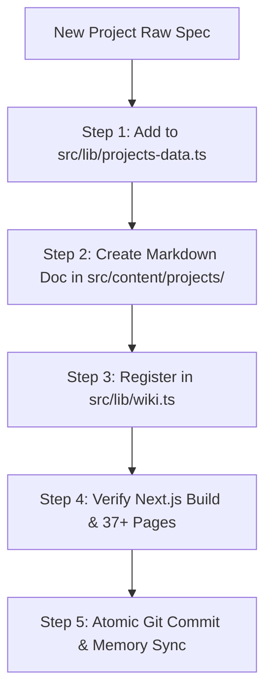

# Showcase Project Builder (Standardized Project & Skill Engineering Protocol)

The **Showcase Project Builder** protocol standardizes the creation, formatting, and multi-channel publication of flagship projects and autonomous agent skills across the personal website ecosystem (`https://alim.dest.page`).

---

## 🏛️ 1. The 8 Mandatory Pillars for Every Showcase Project

Every newly added project or skill **MUST** contain all 8 standardized pillars:

1. **🎨 Generative Code Thumbnail**:
   - Pure code (SVG / CSS / Canvas) visual thumbnail without fragile external dependencies.
   - Distinctive cyber/modern color theme (`neon-cyan`, `lime-cyber`, `purple-matrix`, `amber-brutalism`, or bespoke SVG geometry).
   - High visual contrast, command pill badge, and subtle ambient glow.

2. **⏱️ Initiation Date & Relative Elapsed Time ("как давно")**:
   - ISO Date: `initiationDate` (e.g. `2026-08-10`).
   - Month/Year Badge: `dateDisplay` (e.g. `Aug 2026`).
   - Relative Time Ago: `timeAgo` (e.g. `1 week ago`, `3 weeks ago`, `2 months ago`).

3. **🏷️ Title, Command Hook & TL;DR**:
   - Command identifier (e.g. `/wiki`, `/presentation`, `/skill-visualizer`, `/styleref`, `/new-tool`).
   - Impactful Title and Subtitle.
   - Hyper-concise **TL;DR** (1–2 sentences explaining the unfair advantage or breakthrough).

4. **⚡ Live Interactive Demo / Runner**:
   - Working interactive demo runner, canvas playground, or modal tool directly accessible at `/projects/<slug>#demo` or embedded into the page.

5. **📐 16:9 Skill Visualizer Vector Architecture Map**:
   - Standalone SVG flowchart conforming to the `/skill-visualizer` standard (`viewBox="0 0 1600 900"`).
   - Dynamic Density Scaling (3 to 6 milestone nodes).
   - Unified single-line headers (step badge + title sharing exact same font size & accent color).
   - Zero void space (calibrated card heights).
   - Sharp geometric vector markers (`<path d="M 0 1.5 L 8 5 L 0 8.5 z" />`).

6. **📜 Spec-Driven Development (SDD) Architectural Invariants**:
   - Formal specification including:
     - `Inputs Contract`
     - `Outputs Contract`
     - `System Invariants & Boundary Rules`
     - `Core Engine & State Machine`

7. **🔨 Build Plan Checklist**:
   - Multi-phase actionable build checklist with completed verification checkboxes.

8. **🧪 Test Plan Checklist (TDD Verification)**:
   - Test suites with concrete verifiable assertions and contract guarantees.

---

## 🧭 2. Multi-Channel Auto-Wiring Checklist

When adding a new project or skill, the agent must execute this 5-step integration pipeline:



### Step 1: Register in `src/lib/projects-data.ts`
Add a new typed `ProjectDetail` entry with:
- `slug`, `title`, `command`, `tag`, `accentColor`, `accentGradient`
- `initiationDate`, `dateDisplay`, `timeAgo`
- `tldr`, `headline`, `demoUrl`, `demoType`, `badges`
- `generativeTheme` (`neon-cyan` | `lime-cyber` | `purple-matrix` | `amber-brutalism`)
- `visualizer`: 3–6 `VisualizerNode` items with step badges and accent colors
- `specSDD`: inputs, outputs, invariants, coreEngine, stateMachine
- `buildChecklist` & `testChecklist`

### Step 2: Create Markdown Doc in `src/content/projects/<slug>.md`
Provide complete Markdown documentation with frontmatter:
```markdown
---
title: "<Command> — <Project Title>"
category: "Agent Skill"
section: "projects"
date: "YYYY-MM-DD"
description: "<Punchy summary>"
tags: ["Tag1", "Tag2", "Tag3"]
---
```

### Step 3: Register in `src/lib/wiki.ts`
Add the project to `SYSTEM_ITEMS` or `METHODOLOGY_ITEMS` with its `/projects/<slug>` link so it appears automatically in the public Wiki Hub search index and 2-Tier classification.

### Step 4: Verification Build
Run the Next.js production build check:
```bash
node "node_modules/next/dist/bin/next" build
```
Verify that the static pages generation includes `/projects/<slug>` and `/wiki/<slug>` with zero TypeScript or hydration errors.

### Step 5: Git Commit & Living Memory Sync
Commit changes with the author email `alimzhan.khalelov@gmail.com`:
```bash
git -c user.name="Alimzhan Khalelov" -c user.email="alimzhan.khalelov@gmail.com" commit -m "feat(showcase): add <project-name> with 16:9 visualizer, SDD specs and demo"
```
Update `.agents/agents.md` and `.agents/wiki/user_intent.md`.

---

## 📚 3. Reference Blueprints & Runbooks

- [`references/project-schema.md`](file:///D:/Study&Work/2025/Antigravity%20Vibecoding%20Projects/PersonalWebsite/.agents/skills/showcase-project-builder/references/project-schema.md) — Exact TypeScript interfaces, density scaling math, and SDD spec schemas.
- [`templates/project-template.ts`](file:///D:/Study&Work/2025/Antigravity%20Vibecoding%20Projects/PersonalWebsite/.agents/skills/showcase-project-builder/templates/project-template.ts) — Copy-pasteable boilerplate for new projects.
