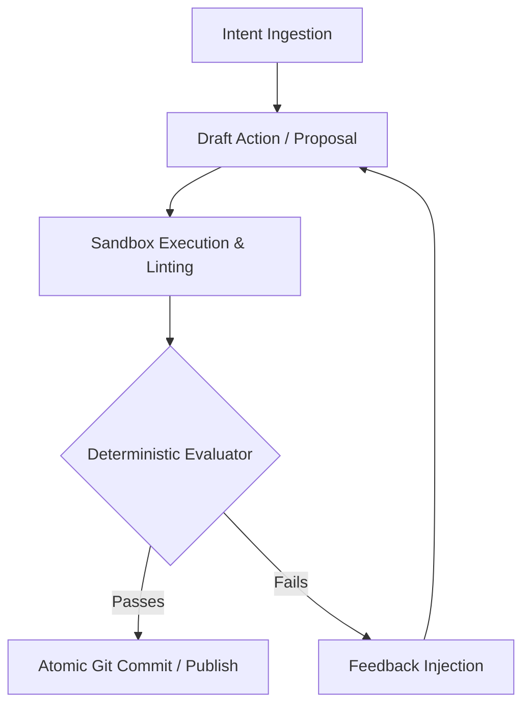

# Loop Engineering: Autonomous LLM Agent Systems

**Loop Engineering** is the practice of structuring Large Language Model interactions not as simple prompt-response chains, but as closed feedback control loops governed by state machines, deterministic evaluators, and persistent memory.

## The Core Problem: Why Simple Prompting Breaks

Standard single-turn prompting suffers from context drift, compounding hallucinations, and lack of error recovery. When an LLM fails in a naive chain, it continues blindly along the faulty trajectory.

In contrast, **Loop Engineering** treats the model as an execution engine inside a rigorous **ReAct (Reason + Act + Observe)** loop:

## Architectural Invariants

1. **Isolation & Harnessing**: Every subagent runs inside an isolated execution environment with precise read/write tool boundaries.
2. **Evaluator-Driven Self-Healing**: Automated tests, TypeScript compiler output, and linter errors are fed back into the reasoning prompt automatically.
3. **Cumulative Memory**: Living state matrix stored in [[systems/category-rag|CategoryRAG]] and `.agents/agents.md` ensures zero recency bias.
4. **Integration with Demiurge.OS**: Works as the core orchestration runtime for [[entities/demiurge-os|Demiurge.OS]] and [[systems/ai-drafting-room|AI Drafting Room]].

## Synergy with Other Methodologies

Loop Engineering operates hand-in-hand with [[concepts/fan-filter-scale|Fan-Filter-Scale]] to automatically generate, filter, and scale product hypotheses with minimal human intervention.
