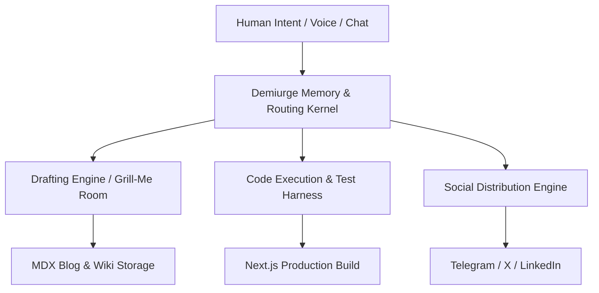

# Demiurge.OS: Autonomous Agent Platform

**Demiurge.OS** is an autonomous operating environment engineered to turn individual builders into high-output software teams through agent swarms.

## Architecture

## Integrated Modules

- **AI Drafting Room**: Built on [[systems/ai-drafting-room|Vercel AI SDK 5]] with multi-model fallback.
- **Knowledge Core**: Grounded with [[systems/category-rag|CategoryRAG Engine]] and [[concepts/graphrag-knowledge|GraphRAG Knowledge]].
- **Distribution Bus**: Handled by [[systems/social-publisher|Social Publisher]].
- **Methodology Grounding**: Built entirely around [[concepts/loop-engineering|Loop Engineering]] and [[concepts/fan-filter-scale|Fan-Filter-Scale]].
