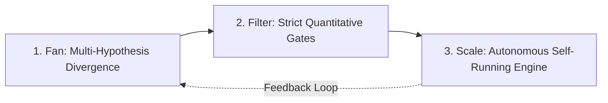

## TL;DR
The **Fan-Filter-Scale** methodology is the foundational operational engine developed by Alim Khalelov for building high-leverage digital products that can scale autonomously with minimal overhead.

---

## The 3 Pillars of Fan-Filter-Scale

### 1. Fan (Divergence Phase)
- **Objective**: Maximize hypothesis volume and surface area of discovery.
- **Mechanism**: Leveraging autonomous AI agents to explore dozens of product angles, prototypes, and user stories simultaneously.
- **Invariant**: In this stage, *quantity creates quality*. Cost of generation is reduced to near-zero via agentic pipelines.

### 2. Filter (Convergence & Elimination Phase)
- **Objective**: Ruthlessly eliminate noise and false signals.
- **Mechanism**: Applying strict data-driven constraints: real user retention signals, technical feasibility boundaries, and unit economics.
- **Invariant**: Only hypotheses demonstrating repeatable retention and clear problem-solution fit survive the gate.

### 3. Scale (Autonomous Execution Phase)
- **Objective**: Double down on winning vectors by engineering self-sustaining loops.
- **Mechanism**: Automating delivery of value, user onboarding, and continuous optimization using closed LLM feedback loops.
- **Invariant**: The system must operate as a self-correcting organism with minimal human bottleneck.

---

## Practical Applications
- **AI-Native Onboarding**: Testing 30+ interactive paywall/onboarding permutations in parallel.
- **Content Syndication**: Multi-platform automated distribution from single core drafts.
- **Pet-Projects Prototyping**: Generating and testing experimental products inside Project Telos.
