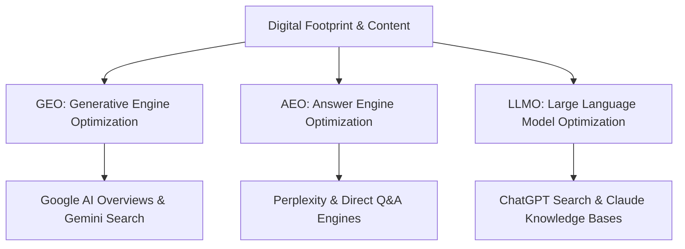

## TL;DR
Classic SEO based purely on keyword density and backlinks is evolving into **GEO (Generative Engine Optimization)**, **AEO (Answer Engine Optimization)**, and **LLMO (Large Language Model Optimization)**.

---

## The 3 Evolutionary Pillars

### 1. GEO (Generative Engine Optimization)
Optimizing content density, quotes, authoritative references, and structured facts so generative summaries cite your URLs directly.

### 2. AEO (Answer Engine Optimization)
Direct-answer structural formatting (concise TL;DR blocks, schema.org FAQPage/Article JSON-LD, tabular breakdowns) tailored for instant extraction without hallucination.

### 3. LLMO (Large Language Model Optimization)
Publishing `llms.txt`, machine-readable sitemaps, semantic markdown, and clear entity definitions that AI crawlers can ingest efficiently.
