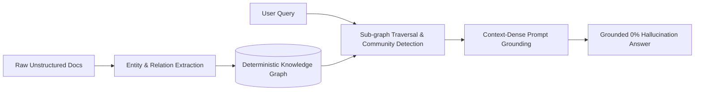

## TL;DR
Vector search alone fails at multi-hop reasoning and structural domain relationships. **GraphRAG** grounds language models in deterministic entity graphs and relationship triplets, ensuring zero-hallucination factual precision.

---

## Why Vector Similarity Fails
Traditional naive RAG chunks text into isolated vector embeddings. While this excels at surface-level cosine similarity matches, it breaks when:
- Queries require cross-document associative reasoning (e.g. *"What common architectural invariant is shared between the CMS and the Agent Loop?"*).
- Ambiguous entity names overlap across domains.
- Contextual hierarchy (parent-child ownership) is discarded.

---

## The GraphRAG Pipeline

1. **Entity Extraction**: Parsing concepts, products, and invariant rules.
2. **Deterministic Links**: Constructing bidirectional links `(Entity)-[RELATION]->(Concept)`.
3. **Multi-Hop Retrieval**: Traversing neighboring nodes to compile structured, verified context before invoking the LLM generation step.
