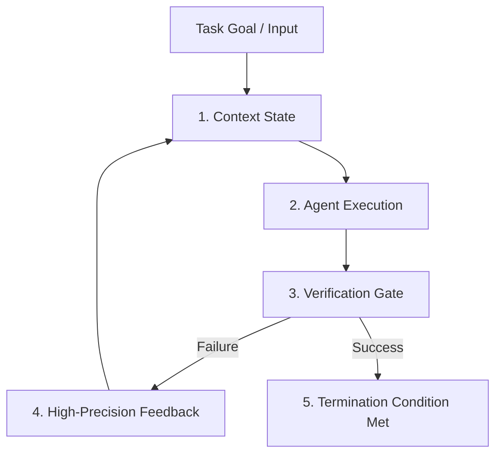

## TL;DR
**Loop Engineering** shifts the paradigm from prompt crafting to control systems design. The equation **Agent + Loop = Autonomy** ensures that instead of human developers acting as a manual correction bottleneck, the agent autonomously validates, iterates, and verifies its output against strict termination conditions.

---

## The 5 Pillars of Closed-Loop Autonomy

1. **Context Management**: Preserving compact, relevant turn-by-turn memory without context window bloat or drift.
2. **Feedback Quality**: Providing exact, actionable signals (e.g. failing compiler logs, unit test stack traces, visual diffs) rather than vague prompts.
3. **Verification Gates**: Explicit deterministic tests (e.g. TypeScript compiler, Vitest, lint rules, headless assertions) checking output integrity.
4. **Termination Condition**: Clear stopping criteria preventing runaway infinite recursion or premature halting.
5. **State Management**: Persisting external artifact state across agent turns.

---

## Deterministic vs Non-Deterministic Loops

| Mode | Target Scope | Feedback Source | Termination Gate |
| :--- | :--- | :--- | :--- |
| **Deterministic** | Code generation, schema compilation, AST building | Compiler, test runner, linter | All tests pass (Exit Code 0) |
| **Non-Deterministic** | Creative writing, design iteration, strategy | Critic Agent, rubrics, Mom-Test heuristics | Score threshold $\ge 9.0/10$ |
